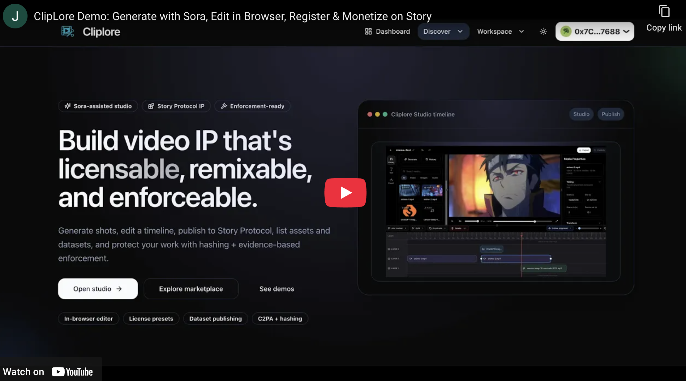

# Cliplore

[](https://cliplore.com/demo-video)

Cliplore is a Next.js 15 App Router app for Sora-assisted video creation, in-browser editing, Story Protocol IP registration/licensing, and IP detection/enforcement with a wallet-first UX.

- Live app: https://cliplore.com
- Demo hub (genres + prompts + Story links): https://cliplore.com/demo
- Demo video: https://www.youtube.com/watch?v=WRJlQDFcxVI
- Pitch deck: https://cliplore.com/pitch-deck
- GitHub: https://github.com/syntaxsurge/cliplore

## Buildathon submission (Surreal World Assets × Story Protocol)

Cliplore is an end-to-end product for **IP-native creation in an AI-driven world**:

**Generate → Edit → Export → Register as Story IP → License → Monetize (IPFi) → Detect & Enforce**

The core idea is simple: making creative work is already hard; registering and enforcing ownership should not be a separate product. Cliplore makes IP registration, licensing, and enforcement part of the same UX used to generate and edit.

## Judge quickstart (3–5 minutes)

1. Open the demo hub (no wallet required): https://cliplore.com/demo
2. Click any genre page and verify:
   - the final cut (YouTube embed)
   - the exact prompts used (copyable)
   - the Story Portal + Explorer links for the registered IP
3. Open the public marketplace and view the license mint flow: https://cliplore.com/explore → `/ip/[ipId]` (browsing is public; minting requires a wallet)
4. Open enforcement tooling: https://cliplore.com/enforcement
5. (Optional, wallet-gated creator app) Open the studio/editor: https://cliplore.com/projects → publish via `/projects/[id]/publish`

## Generative video submissions (5 genres)

Each genre is a **30-second** video (2 × 15s clips) generated with **Sora**, edited in Cliplore’s timeline editor, exported, and registered on **Story Protocol**.

| Genre | Demo page (prompts + links) | YouTube | Story Portal | Story Explorer |
|---|---|---|---|---|
| Anime | [Demo](https://cliplore.com/demo/anime) | [YouTube](https://youtu.be/arg3it3d3cI) | [Portal](https://portal.story.foundation/assets/0x876e3422350D7A9f5Cb158909E6DD07817C3539d) | [Explorer](https://explorer.story.foundation/ipa/0x876e3422350D7A9f5Cb158909E6DD07817C3539d) |
| Horror | [Demo](https://cliplore.com/demo/horror) | [YouTube](https://youtu.be/nG9PKo_tlfw) | [Portal](https://portal.story.foundation/assets/0x9C24ccD6256067fb26029Be3bcF0731d38535d26) | [Explorer](https://explorer.story.foundation/ipa/0x9C24ccD6256067fb26029Be3bcF0731d38535d26) |
| Sci‑Fi + Fantasy | [Demo](https://cliplore.com/demo/fantasy) | [YouTube](https://youtu.be/yAPCginIIbY) | [Portal](https://portal.story.foundation/assets/0xF0607E8F6506A6e6d6EE73A5C34eaeEF9F72156D) | [Explorer](https://explorer.story.foundation/ipa/0xF0607E8F6506A6e6d6EE73A5C34eaeEF9F72156D) |
| Commercial / Spec‑Ads | [Demo](https://cliplore.com/demo/commercial) | [YouTube](https://youtu.be/PYIlIg82aLc) | [Portal](https://portal.story.foundation/assets/0xC3f6c2F997aC7b2Cc7e3BdCf91398CCcDFEaDA73) | [Explorer](https://explorer.story.foundation/ipa/0xC3f6c2F997aC7b2Cc7e3BdCf91398CCcDFEaDA73) |
| Brainrot | [Demo](https://cliplore.com/demo/brainrot) | [YouTube](https://youtu.be/To8Z_Cvv1fk) | [Portal](https://portal.story.foundation/assets/0x62d31e0dA2aA48505c5CEf0c07BA817b4764E012) | [Explorer](https://explorer.story.foundation/ipa/0x62d31e0dA2aA48505c5CEf0c07BA817b4764E012) |

## Track alignment

### Creative Front-End

Cliplore focuses on a polished, friendly UX for real IP × AI creation flows:

- A modern marketing + discovery surface (`/`, `/demo`, `/explore`, `/ip/[ipId]`, `/datasets`) that makes “see the work + mint a license” a single click path.
- A wallet-first creator app (RainbowKit + Wagmi) with clear separation between public pages and authenticated creation flows.
- A full-screen, in-browser editor (`/projects/[id]`) with timeline layers, a canvas preview, inspector controls, and keyboard-first editing.
- A publish wizard (`/projects/[id]/publish`) that turns a finished cut into a Story-registered IP asset with pinned metadata.

### Generative Video

Cliplore is built for generating and finishing videos inside one workflow:

- Sora job orchestration via `/api/sora` and `/api/sora/content`.
- BYOK key management via Settings (`/settings`) using an encrypted HTTP-only cookie (key encryption configured by `OPENAI_BYOK_COOKIE_SECRET` in `.env.local`).
- In-browser editing and export with a timeline editor + Remotion preview; export supports CPU (`ffmpeg.wasm`) and GPU (`@diffusionstudio/core`) paths.
- A demo system (`/demo` and `/demo/[slug]`) that publishes final cuts with exact prompts and Story registration links for each genre.

### IPFi

Cliplore treats published media as financial primitives after registration:

- Creator asset library (`/assets`) and per-asset dashboards (`/assets/[ipId]`).
- Licensing UX (terms + minting) and a Royalties tab that resolves the IP Royalty Vault and gates actions until the vault is deployed.
- Royalties flows including tip/claim, plus IP/WIP balance utilities for wrap/unwrap and royalty-token transfers.

### Data

Cliplore supports dataset-native IP, not just media:

- Dataset publisher (`/datasets/new`) that uploads sample/cover to Backblaze B2, pins dataset + Story metadata to IPFS, registers on Story, and syncs marketplace records to Convex.
- Dataset marketplace (`/datasets`) and dataset detail pages (`/datasets/[ipId]`) with Story + IPFS references.
- Dataset registration uses IPA metadata with `ipType: "dataset"` and a structured, versioned dataset payload (`cliplore.dataset.v1`) capturing modalities, capture context, sensors, releases, manifest pointers, and hashed artifacts.

### IP Detection & Enforcement

Cliplore includes an enforcement workflow designed for real disputes, not just detection:

- Verify suspected content via SHA-256 (file upload or URL hashing with SSRF/size limits) and C2PA Content Credentials (`/enforcement`).
- Pin evidence bundles to IPFS (CIDv0, `Qm`-prefixed CIDs) for Story disputes via `/api/enforcement/pin-evidence`.
- Raise disputes via the Story SDK and store fingerprints + reports in Convex for follow-up and auditability.

## Product routes

### Public (no wallet required)

- `/` — marketing homepage (product overview + CTAs)
- `/explore` — IP marketplace list (Convex-backed)
- `/datasets` — dataset marketplace list (Convex-backed)
- `/demo` — demo hub (genre cards with video/prompt links)
- `/demo/[slug]` — demo detail (YouTube embed, Story links, exact prompts)
- `/ip/[ipId]` — IP asset detail + license minting + remix project CTA + owner-only dashboard shortcut
- `/datasets/[ipId]` — dataset detail + license minting + Story/IPFS references + owner-only dashboard shortcut

### Creator app (wallet-gated)

- `/dashboard` — creator dashboard (projects + IP assets + marketplace listing status)
- `/projects` — project list (local drafts + optional Convex metadata sync)
- `/projects/[id]` — full-screen editor (header/footer hidden)
- `/projects/[id]/publish` — publish wizard (upload export to B2, pin Story metadata to IPFS, register on Story)
- `/projects/[id]/ipfi` — published-export picker that links into the asset dashboard
- `/assets` — creator asset library (published Story IP assets + local backfill sync + archive/unarchive marketplace visibility)
- `/assets/[ipId]` — asset dashboard (overview, licensing terms, royalties, files & metadata)
- `/datasets/new` — dataset publisher (upload sample + cover to B2, pin Story metadata to IPFS, register on Story, sync to Convex)
- `/enforcement` — IP detection & enforcement (verify hashes + C2PA, pin evidence, raise Story disputes)
- `/projects/[id]/ip` — redirects to `/projects/[id]/publish`
- `/projects/[id]/monetization` — redirects to `/projects/[id]/publish`
- `/settings` — creator profile + default license preset + OpenAI BYOK key

## Tech stack

- Next.js 15 (App Router) + TypeScript
- Tailwind CSS + shadcn-style UI primitives
- Wagmi + RainbowKit (wallet-first UX)
- Story Protocol SDK (IP registration, licensing, royalties, disputes)
- Remotion Player + `@remotion/media` (preview + playback)
- `ffmpeg.wasm` + Diffusion Core (in-browser export)
- Convex (marketplace lists + metadata sync)
- Backblaze B2 (S3-compatible, direct-from-browser uploads)
- IPFS via Pinata (Story metadata + enforcement evidence)

## Local development

1. Install dependencies:
   ```bash
   pnpm install
   ```
2. Create `.env.local` from `.env.example` and fill it out (the `.env.example` file is the source of truth):
   ```bash
   cp .env.example .env.local
   ```
3. Start the dev server:
   ```bash
   pnpm dev
   ```
4. Open http://localhost:3000

## License

MIT — see `LICENSE`.
